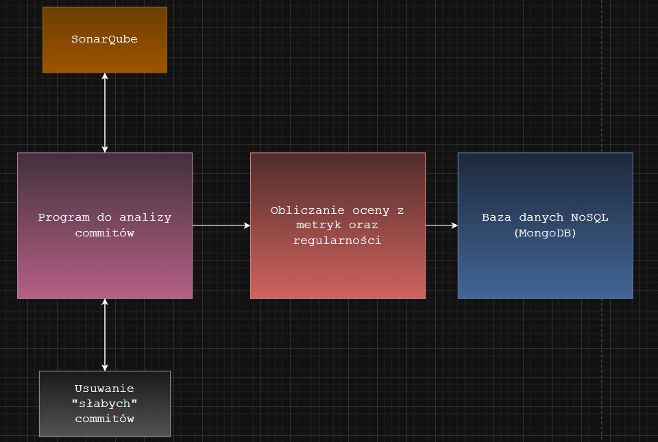

# Analiza commitów i jakości kodu

## 1. Cel programu

Program automatyzuje monitorowanie i ocenę jakości kodu w repozytorium:

- Pobiera historię commitów z repozytorium GitHub.
- Analizuje kod źródłowy każdego commit'u pod kątem błędów, podatności i zapachów kodu.
- Oblicza metryki jakości kodu i przyrosty błędów między kolejnymi commitami.
- Identyfikuje commity, które nie wprowadzają istotnych zmian w kodzie.
- Zapisuje wyniki do bazy danych.

---

## 2. Ogólny schemat działania

1. **Przygotowanie środowiska**
   - Wczytanie niezbędnych ustawień i tokenów dostępowych.
   - Utworzenie katalogu roboczego do pracy z repozytorium.

2. **Pobranie commitów**
   - Pobranie pełnej historii commitów z wybranej gałęzi repozytorium.
   - Sortowanie commitów w kolejności chronologicznej.

3. **Przygotowanie repozytorium**
   - Klonowanie repozytorium, jeśli nie jest dostępne lokalnie.
   - Synchronizacja repozytorium z najnowszą wersją w zdalnym repozytorium.

4. **Analiza kodu**
   - Uruchomienie narzędzia do analizy statycznej kodu.
   - Oczekiwanie na zakończenie analizy i pobranie wyników.
   - Wyodrębnienie kluczowych metryk jakości kodu: bugs, vulnerabilities, code smells oraz duplicated_lines_density.

5. **Przetwarzanie danych**
   - Konwersja wyników na wartości numeryczne.
   - Obliczenie przyrostów metryk między kolejnymi commitami.
   - Zachowanie wartości początkowych dla pierwszego commit’u.

6. **Filtrowanie i raportowanie**
   - Usunięcie commitów, które nie wprowadzają istotnych zmian w kodzie.
   - (w trakcie) Wystawienie oceny każdej osobie na podstawie średniej ważonej z jakości, ilości oraz regularności commitów (skala 2-5 ostatecznej oceny jak i poszczególnych składowych) 
   - Zapisanie przeanalizwoanych danych w bazie danych.
---

## 3. Struktura katalogów

workspace/
├─ repo/ # lokalne repozytorium do analizy
├─ sonar-project.properties # plik konfiguracyjny potrzebny do analizy generowany automatycznie przez program

## 4. Struktura działania programu
